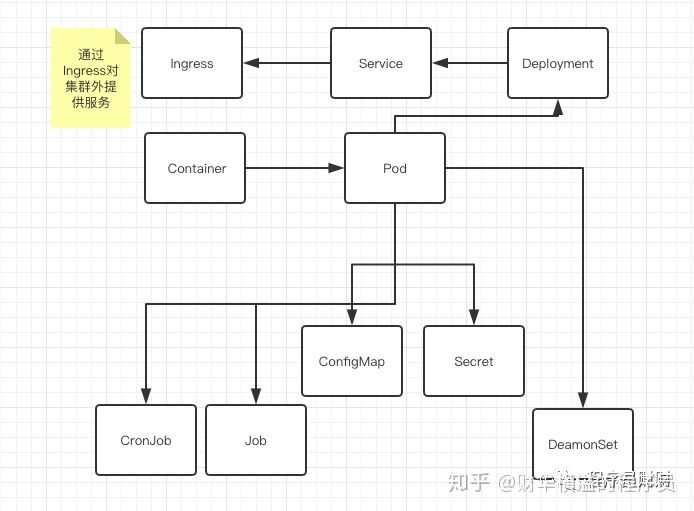
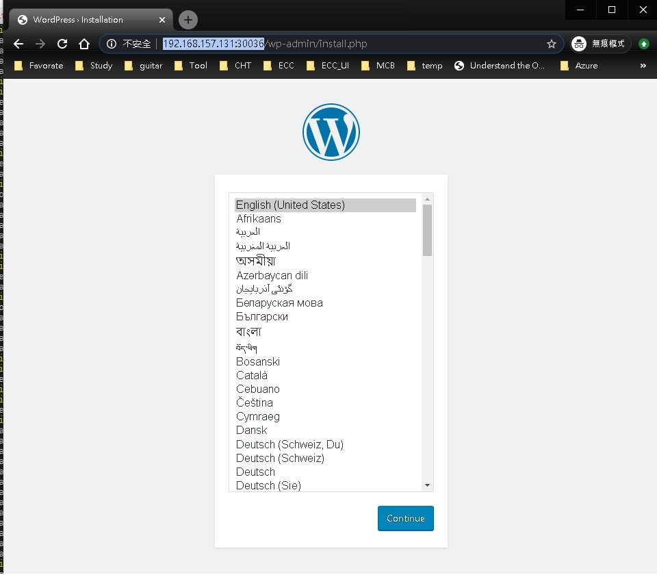

# K8s

### installation 
    $sudo snap install microk8s --classic
    $sudo snap alias microk8s.kubectl kubectl
    sudo microk8s.enable storage
    sudo microk8s enable dns

# Deploy wordpress and mysql   
#### (https://kubernetes.io/docs/tutorials/stateful-application/mysql-wordpress-persistent-volume/ )
### Deploy sequencely
    $ kubectl create secret generic mysql-pass --from-literal=password=chttl232
    $ kubectl create -f .\mysql-deployment.yaml
    $ kubectl create -f .\wordpress-deployment.yaml
    
### Or you can combine two yaml files above into one kustomization.yaml then  
    $ kubectl apply -k ./               //kustomization.yaml
    secret/mysql-pass-m6cckc2mch created
    service/wordpress-mysql created
    service/wordpress created
    deployment.apps/wordpress-mysql created
    deployment.apps/wordpress created
    persistentvolumeclaim/mysql-pv-claim created
    persistentvolumeclaim/wp-pv-claim created

### Show service
    $ sudo kubectl get service
    NAME              TYPE        CLUSTER-IP       EXTERNAL-IP   PORT(S)        AGE
    kubernetes        ClusterIP   10.152.183.1     <none>        443/TCP        46d
    wordpress         NodePort    10.152.183.160   <none>        80:30036/TCP   46d
    wordpress-mysql   ClusterIP   None             <none>        3306/TCP       46d

    $ sudo kubectl get service -o wide
    NAME              TYPE        CLUSTER-IP       EXTERNAL-IP   PORT(S)        AGE   SELECTOR
    kubernetes        ClusterIP   10.152.183.1     <none>        443/TCP        46d   <none>
    wordpress         NodePort    10.152.183.160   <none>        80:30036/TCP   46d   app=wordpress,tier=frontend
    wordpress-mysql   ClusterIP   None             <none>        3306/TCP       46d   app=wordpress,tier=mysql

### Show Deployment
    $ sudo kubectl get deployment.apps/wordpress-mysql
    NAME              READY   UP-TO-DATE   AVAILABLE   AGE
    wordpress-mysql   1/1     1            1           46d

    $ sudo kubectl get deployment.apps/wordpress
    NAME        READY   UP-TO-DATE   AVAILABLE   AGE
    wordpress   1/1     1            1           46d

    $ sudo kubectl get deployment.apps/wordpress-mysql -o wide
    NAME              READY   UP-TO-DATE   AVAILABLE   AGE   CONTAINERS   IMAGES      SELECTOR
    wordpress-mysql   1/1     1            1           46d   mysql        mysql:5.6   app=wordpress,tier=mysql

    $ sudo kubectl get deployment.apps/wordpress-mysql -o yaml
    ..... (TL )

### Show ReplicaSet
    $ sudo kubectl get rs
    NAME                         DESIRED   CURRENT   READY   AGE
    wordpress-584746894f         1         1         1       46d
    wordpress-mysql-85688bfdb7   1         1         1       46d

    $ sudo kubectl get rs -o wide
    NAME                         DESIRED   CURRENT   READY   AGE   CONTAINERS   IMAGES                 SELECTOR
    wordpress-584746894f         1         1         1       46d   wordpress    wordpress:4.8-apache   app=wordpress,pod-template-hash=584746894f,tier=frontend
    wordpress-mysql-85688bfdb7   1         1         1       46d   mysql        mysql:5.6              app=wordpress,pod-template-hash=85688bfdb7,tier=mysql

### Show Pods 
    s$ sudo kubectl get pods
    NAME                               READY   STATUS    RESTARTS   AGE
    wordpress-584746894f-64b4x         1/1     Running   4          46d
    wordpress-mysql-85688bfdb7-49w26   1/1     Running   3          46d

    $ sudo kubectl get pods -o wide
    NAME                               READY   STATUS    RESTARTS   AGE   IP           NODE     NOMINATED NODE   READINESS GATES
    wordpress-584746894f-64b4x         1/1     Running   4          46d   10.1.56.20   ubuntu   <none>           <none>
    wordpress-mysql-85688bfdb7-49w26   1/1     Running   3          46d   10.1.56.19   ubuntu   <none>           <none>

### EXEC Container
    $ sudo kubectl exec -it wordpress-584746894f-64b4x bash
    kubectl exec [POD] [COMMAND] is DEPRECATED and will be removed in a future version. Use kubectl kubectl exec [POD] -- [COMMAND] instead.
    root@wordpress-584746894f-64b4x:/var/www/html# exit

    In Future use  : $ sudo kubectl exec -it wordpress-584746894f-64b4x -- bash

### Debugging
> https://kubernetes.io/docs/tasks/debug-application-cluster/debug-application-introspection/)
    $ kubectl get events
    $ kubectl describe pods <podsName>
    $ kubectl logs <podsName>

### Delete pods to restart pods
    $ kubectl delete pods wordpress-mysql-9899c67db-77plt

### Verify PersistentVolume
    $ kubectl get pvc
    NAME             STATUS    VOLUME                                     CAPACITY   ACCESS MODES   STORAGECLASS       AGE
    mysql-pv-claim   Bound     pvc-8cbd7b2e-4044-11e9-b2bb-42010a800002   20Gi       RWO            standard           77s
    wp-pv-claim      Bound     pvc-8cd0df54-4044-11e9-b2bb-42010a800002   20Gi       RWO            standard           77s

### Stop 
    $kubectl get deployments
        NAME              READY   UP-TO-DATE   AVAILABLE   AGE
        wordpress         1/1     1            1           52m
        wordpress-mysql   1/1     1            1           52m
    $ kubectl scale --replicas=0 deployments/wordpress
        deployment.extensions/wordpress scaled
    $ kubectl scale --replicas=0 deployments/wordpress-mysql
        deployment.extensions/wordpress-mysql scaled

### Cleaning up

> Run the following command to delete your Secret, Deployments, Services and PersistentVolumeClaims:**

    $ sudo kubectl delete -k ./
    secret "mysql-pass-m6cckc2mch" deleted
    service "wordpress-mysql" deleted
    service "wordpress" deleted
    deployment.apps "wordpress-mysql" deleted
    deployment.apps "wordpress" deleted
    persistentvolumeclaim "mysql-pv-claim" deleted
    persistentvolumeclaim "wp-pv-claim" deleted

> **'type: loadbalance' is used for public cloud ;  
'type: NodePort' let you export service pods  to other services in the same node.**

# K8s commands to show status
    $ kubectl describe pods
    $ kubectl describe service
    $ kubectl describe svc <wordpress-mysql>
    $ kubectl describe deployment  
    $ kubectl get service -o wide
    $ kubectl get secrets
    $ kubectl get pvc
    $ kubectl get deployments
    $ kubectl get pods
    $ kubectl get nodes
    $ kubectl get all
    $ kubectl get all --all-namespaces
    
    $ kubectl config view
    $ kubectl config get-contexts
    $ kubectl config use-context docker-for-desktop
    $ kubectl create -f <service.yml, deploy.yam, ...>
    $ kubectl delete -f <service.yml, deploy.yam, ...>
    $ kubectl apply -f <service.yml, deploy.yam, ...>
    $ kubectl create namespace <name>
    
# reference : 
- Local Kubernetes for Windows — MiniKube vs Docker Desktop
https://medium.com/containers-101/local-kubernetes-for-windows-minikube-vs-docker-desktop-25a1c6d3b766

- https://github.com/kubernetes/dashboard
kubectl apply -f https://raw.githubusercontent.com/kubernetes/dashboard/v1.10.1/src/deploy/recommended/kubernetes-dashboard.yaml
kubectl proxy

- kubectl -n kube-system describe secret $(kubectl -n kube-system get secret | grep admin-user | awk '{print $1}')

- http://localhost:8001/api/v1/namespaces/kube-system/services/https:kubernetes-dashboard:/proxy/#!/overview?namespace=default

# Example for Deploy another Service

### deployment nginx
    $ kubectl create -f nginx-deployment.yaml
        deployment.apps/nginx-deployment created

### Show deployment
    $ kubectl get deployments/nginx-deployment -o yaml

### Show ReplicaSet
    $kubectl get rs -o wide
    NAME                          DESIRED   CURRENT   READY   AGE     CONTAINERS   IMAGES         SELECTOR
    nginx-deployment-66f7f56f56   2         2         2       2m41s   nginx        nginx:1.15.4   app=nginx,pod-template-hash=66f7f56f56

### Show Pod 
    $ kubectl get pods -o wide
    NAME                                READY   STATUS    RESTARTS   AGE   IP         NODE             NOMINATED NODE   READINESS GATES
    nginx-deployment-66f7f56f56-h52m8   1/1     Running   0          13m   10.1.0.6   docker-desktop   <none>           <none>
    nginx-deployment-66f7f56f56-pl5b6   1/1     Running   0          13m   10.1.0.5   docker-desktop   <none>           <none>

### EXEC Container
    $ kubectl exec -it nginx-deployment-66f7f56f56-h52m8 bash
    root@nginx-deployment-66f7f56f56-h52m8:/# ls
    bin  boot  dev  etc  home  lib  lib64  media  mnt  opt  proc  root  run  sbin  srv  sys  tmp  usr  var

 

# Deployment service hello 
### Run service
    $kubectl create -f .\hello-service.yaml
    service/hello created

### Show service
    $ kubectl get service -o wide
    NAME         TYPE        CLUSTER-IP     EXTERNAL-IP   PORT(S)   AGE    SELECTOR
    hello        ClusterIP   10.99.166.10   <none>        80/TCP    13s    app=nginx
    kubernetes   ClusterIP   10.96.0.1      <none>        443/TCP   154m   <none>

### Delete service
    $ kubectl delete -f .\nginx-deployment.yaml
        deployment.apps "nginx-deployment" deleted

### Show pods logs 
    $ kubectl logs frontend-895c8799c-ckdvc
    2019/12/11 00:39:01 [emerg] 1#1: host not found in upstream "hello" in /etc/nginx/conf.d/frontend.conf:2
    nginx: [emerg] host not found in upstream "hello" in /etc/nginx/conf.d/frontend.conf:2
